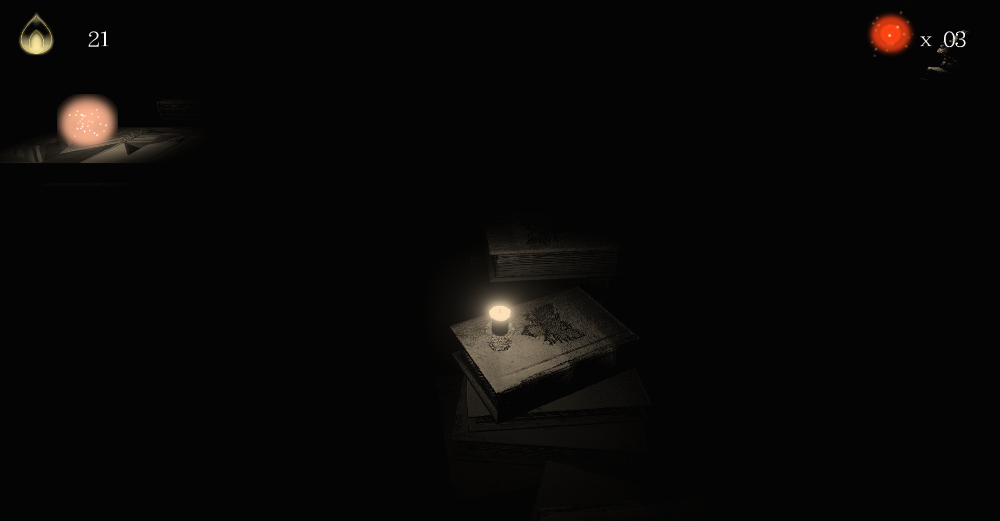
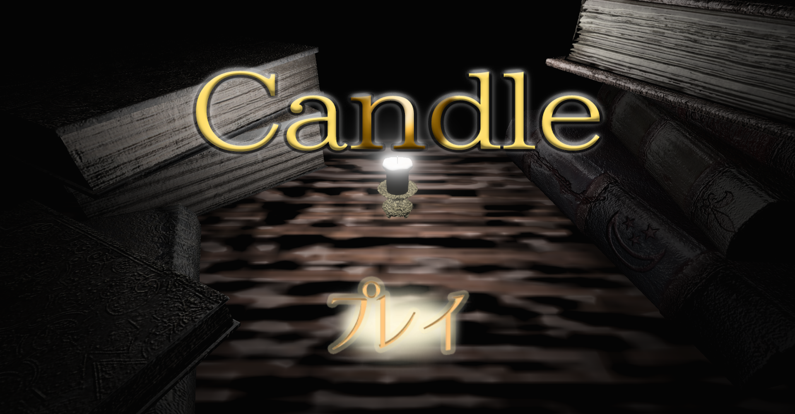
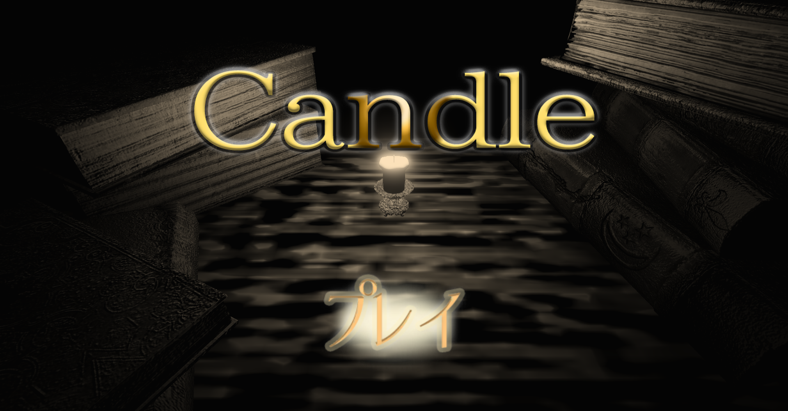
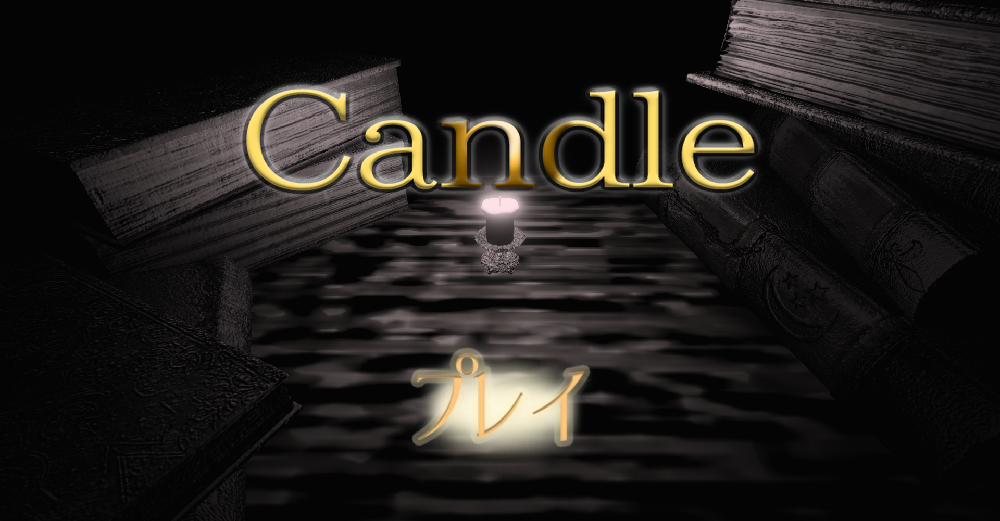
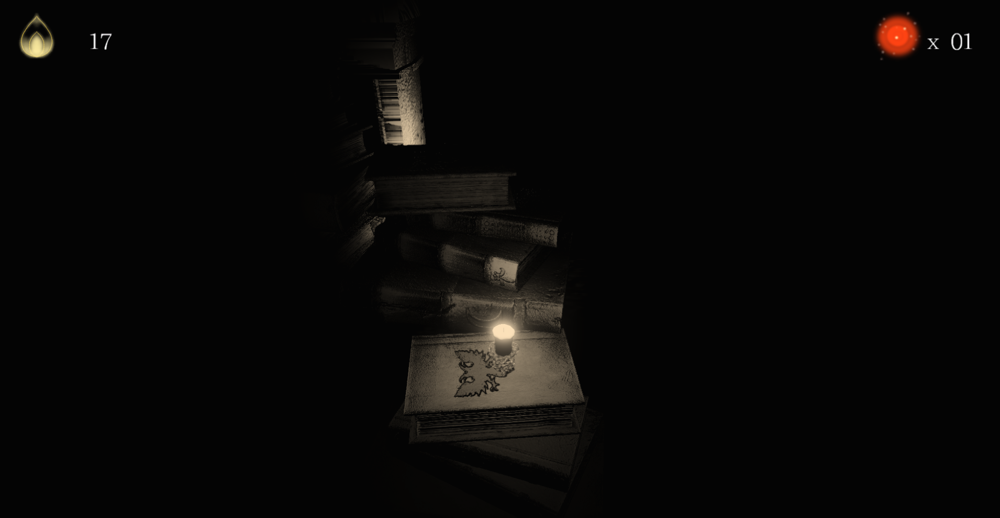

# Candle
河原電子ビジネス専門学校 
ゲームクリエイター科2年　武智花菜

# 目次
1. [作品概要](#sakuhin-gaiyo) 
2. [操作説明](#sousa-setumei) 
3. [セピア調フィルター](#sepia) 
4. [こだわり](#kodawari) 

# 1.作品概要
## Candle
</img> 
&ensp; ろうそくが主人公の、三人称視点ミニアクションゲームです。 
&ensp; 炎が燃え尽きないよう、経過地点にある炎の持続時間を延ばすアイテムを集めながらゴールを目指すゲームになっています。 
* ### 使用したゲームエンジン
&emsp;学内製のエンジンを使用
* ### 使用したツール
&emsp;VisualStudio 2019 
&emsp;3dsMax 2022 
&emsp;Adobe Photoshop 
&emsp;ireAlpaca 
&emsp;Git 
* ### 使用した言語
&emsp;C++  
&emsp;HLSL  
* ### 開発環境
&emsp;Windows10 
&emsp;DirectX12 
* ### 制作人数
&emsp;1人
* ### 開発期間
&emsp;2022年8月

# 2.操作説明
左スティック→プレイヤー移動 
Bボタン→ジャンプ 
アイテムをすべて集め、ゴールにたどり着いたらクリア。 
ゴールにたどり着く前に炎が燃えつきてしまうとゲームオーバーです。 

# 3.セピア調フィルター
&ensp; プレイヤーや背景にアンティークな雰囲気のモデルを使ったため、ひと目見ただけでもそれが伝わるよう、ポストエフェクトを使ってセピア調フィルターを実装しました。 
&ensp; メインレンダリングターゲットのテクスチャを取得し、RGBの成分ごとに重みをつけ、それを代入するという方法で実装しています。赤(R)の成分の重みを一番大きくすることで、セピアの褐色な見た目を表現しています。 
&ensp; パラメーターを調整することで、色味を変えることができるため、使いたい場面などによって印象を変えることができます。 
 
↓セピア調フィルターをかけない場合 
</img> 
↓セピア調フィルターをかけた場合 
</img> 
↓セピア調フィルターをかけ、パラメータ調整した場合 
</img> 

# 4.こだわり
- ### **ライティング**
&emsp;ろうそくの光を際立たせるために、細かくライティングの調整をしました。見えなければいけないところが見えなかったり、見える範囲が広すぎて難易度が下がったりしてしまっていたので、この調整に時間をかけて丁寧に取り組みました。
- ### **アセットの統一感やサイズ感**
&emsp;プレイヤーがろうそくのため、ステージのサイズ感や設置するものに気を使いました。サイズ感を間違えると、そこをろうそくが走っていることに違和感が出てしまうため、特にステージのサイズの調整は念入りに行いました。 
 
</img> 